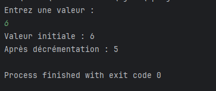
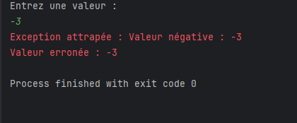
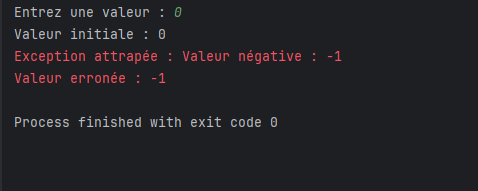

<h2>TP 5 : Gestion des exceptions</h2>
<h3>Exercice 1 :</h3>
<h4>Cas de test 1 : Entrée 6</h4>

<h4>Cas de test 2 : Entrée -3</h4>

<h4>Cas de test 3 : Entrée 0</h4>

<h3>________________________________________________________________________________________________</h3>
<h3>Exercice 2 :</h3>
<h4></h4>
